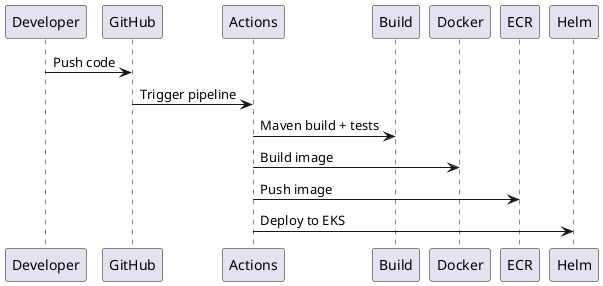

# SPEC-1-Cinema Booking System

## Background

We are designing a high-scale, multi-theater Cinema Hall Management and Ticket Booking System. The platform allows users to browse movies across cities, select theaters and showtimes, reserve seats in real-time, and complete bookings using a real payment gateway.

The system must support high concurrency, prevent double booking, and scale horizontally. It will be built using Java (Spring Boot), Angular, MySQL, JWT authentication, and Docker-based deployment.

---

## Requirements

### Functional Requirements (MoSCoW)

#### Must Have
- User authentication (JWT-based)
- Multi-city, multi-theater support
- Movie browsing and show discovery
- Seat layout visualization
- Real-time seat availability
- Seat locking with expiration (5 mins)
- Ticket booking and confirmation
- Payment gateway integration (Razorpay/Stripe)
- Admin panel:
  - Manage movies
  - Manage theaters/screens
  - Schedule shows
- Booking history

#### Should Have
- Dynamic pricing (time/seat-based)
- Seat categories
- Cancellation & refunds
- Notifications (email/SMS)
- Search & filters

#### Could Have
- Coupons/loyalty
- Ratings/reviews

#### Won’t Have
- ML recommendations
- External aggregator APIs

---

### Non-Functional Requirements

#### Must
- Strong consistency for seat booking
- High concurrency support
- Horizontal scalability
- Secure APIs (JWT + RBAC)
- Dockerized services

#### Should
- <300ms response time for key APIs
- Observability (logs, metrics)

---

## Method

### High-Level Architecture

```plantuml
@startuml
!define RECTANGLE class

RECTANGLE Client
RECTANGLE "API Gateway" as APIG
RECTANGLE "Auth Service" as AUTH
RECTANGLE "Booking Service" as BOOK
RECTANGLE "Show Service" as SHOW
RECTANGLE "Payment Service" as PAY
RECTANGLE "Notification Service" as NOTIF
RECTANGLE "MySQL DB"
RECTANGLE "Redis Cache"
RECTANGLE "Message Queue (Kafka)"

Client --> APIG
APIG --> AUTH
APIG --> SHOW
APIG --> BOOK
APIG --> PAY

BOOK --> Redis Cache
BOOK --> MySQL DB
SHOW --> MySQL DB
AUTH --> MySQL DB
PAY --> MySQL DB

BOOK --> Kafka
Kafka --> NOTIF

@enduml
```

---

### Core Services

#### 1. Auth Service
- JWT issuance & validation
- Role-based access (USER, ADMIN)

#### 2. Show Service
- Movies, theaters, screens, shows
- Read-heavy → cache with Redis

#### 3. Booking Service (Critical)
- Seat locking
- Booking confirmation
- Prevent double booking

#### 4. Payment Service
- Integrates with Razorpay/Stripe
- Handles payment status, retries, webhooks

#### 5. Notification Service
- Async via Kafka

---

### Database Schema (MySQL)

#### Users
- id (PK)
- name
- email (unique)
- password_hash
- role

#### Theater
- id
- name
- city

#### Screen
- id
- theater_id
- name
- total_seats

#### Seat
- id
- screen_id
- seat_number
- category

#### Movie
- id
- title
- duration
- language

#### Show
- id
- movie_id
- screen_id
- start_time
- price

#### Booking
- id
- user_id
- show_id
- status (PENDING, CONFIRMED, FAILED)
- total_amount

#### Booking_Seat
- id
- booking_id
- seat_id

#### Seat_Lock (Redis preferred)
- key: showId:seatId
- value: userId
- TTL: 5 min

---

### Seat Locking Algorithm (Production-Grade)

**Design Decisions Confirmed**
- Fail fast if Redis is unavailable
- Auto-release locks via TTL (5 minutes)

**Flow**
1. User selects seats
2. Booking Service attempts atomic locks in Redis using pipeline:
   - `SET key=showId:seatId value=userId NX PX=300000`
3. If ANY lock fails:
   - Release all previously acquired locks (best-effort delete)
   - Return failure to client (no fallback to DB)
4. If ALL locks succeed:
   - Generate `reservationId`
   - Store lightweight reservation record in DB (status=PENDING, expires_at)
5. Client proceeds to payment

**On Payment Success (Webhook-driven)**
1. Payment Service validates signature (Razorpay/Stripe)
2. Idempotency check using `payment_id`
3. Booking Service:
   - Verifies reservation not expired
   - Creates Booking + Booking_Seat rows (single DB transaction)
   - Deletes Redis locks
   - Marks reservation CONFIRMED

**On Timeout / Failure**
- Redis keys expire automatically (TTL)
- Background job (cron) cleans expired PENDING reservations in DB

**Idempotency**
- All booking confirmations use `idempotency_key = payment_id`
- Duplicate webhooks safely ignored

---

### Concurrency Strategy

- Redis as the **single source of truth for seat availability during reservation window**
- MySQL enforces **final consistency** with unique constraint `(show_id, seat_id)` via Booking_Seat join
- No fallback if Redis is down → system returns 503 (fail fast)
- All critical APIs are idempotent (booking, payment confirmation)


- Redis for distributed locking
- DB unique constraint: (show_id, seat_id)
- Idempotent booking APIs

---

### Payment Flow

```plantuml
@startuml
User -> Booking Service: Reserve seats
Booking Service -> Redis: Lock seats
User -> Payment Service: Initiate payment
Payment Service -> Gateway: Create order
Gateway --> Payment Service: Success webhook
Payment Service -> Booking Service: Confirm booking
Booking Service -> DB: Save booking
@enduml
```

---

## Implementation

### Deployment & Infrastructure (Recommended)

**Cloud Provider: AWS**
- EKS (Kubernetes) for container orchestration
- RDS (MySQL) for relational database
- ElastiCache (Redis) for seat locking
- MSK (Kafka) for messaging
- API Gateway + ALB for routing

**Architecture Approach: Modular Monolith → Microservices Evolution**

- Start as a **modular monolith** (single Spring Boot app with clear module boundaries):
  - auth-module
  - booking-module
  - show-module
  - payment-module

- Enforce separation via package structure + interfaces
- Deploy as a single container initially

- Gradually extract into microservices when:
  - Traffic increases
  - Team size grows
  - Independent scaling needed

**Why this approach?**
- Faster development
- Easier debugging
- Avoids premature distributed complexity
- Smooth migration path to microservices

---

### Implementation Steps

1. Setup modular monolith (Spring Boot)
2. Define module boundaries (hexagonal architecture)
3. Configure MySQL (RDS) schemas
4. Integrate Redis (ElastiCache) for locking
5. Implement booking + locking logic
6. Integrate payment gateway (webhooks + idempotency)
7. Add Kafka (MSK) for async flows
8. Build Angular frontend
9. Containerize using Docker
10. Deploy to AWS EKS
11. Setup CI/CD (GitHub Actions + Helm)


1. Setup microservices (Spring Boot)
2. Configure API Gateway (Spring Cloud Gateway)
3. Implement Auth (JWT)
4. Design MySQL schemas
5. Integrate Redis for seat locking
6. Implement booking APIs with transaction handling
7. Integrate payment gateway (webhooks)
8. Add Kafka for async processing
9. Build Angular frontend
10. Dockerize services

---

## API Design (REST, Production-Grade)

### Conventions
- Base URL: `/api/v1`
- Auth: `Authorization: Bearer <JWT>`
- Idempotency: `Idempotency-Key` header for booking/payment पुष्टि
- Standard response:
```
{
  "success": true,
  "data": {},
  "error": null
}
```

---

### Auth APIs
- `POST /auth/register`
- `POST /auth/login`
- `GET /auth/me`

---

### Movie & Show Discovery
- `GET /cities`
- `GET /movies?city={city}`
- `GET /theaters?city={city}`
- `GET /shows?movieId=&theaterId=&date=`
- `GET /shows/{showId}/seats`

Response (Seats):
```
{
  "seatId": 1,
  "number": "A1",
  "category": "GOLD",
  "status": "AVAILABLE|LOCKED|BOOKED"
}
```

---

### Booking APIs (Critical)

#### 1. Lock Seats
`POST /bookings/lock`
```
{
  "showId": 101,
  "seatIds": [1,2,3]
}
```
Response:
```
{
  "reservationId": "uuid",
  "expiresAt": "timestamp"
}
```

#### 2. Create Payment Order
`POST /payments/order`
```
{
  "reservationId": "uuid"
}
```
Response:
```
{
  "orderId": "gateway_order_id",
  "amount": 500
}
```

#### 3. Payment Webhook (Gateway → Backend)
`POST /payments/webhook`
- Validates signature
- Triggers booking confirmation

#### 4. Confirm Booking (Internal)
`POST /bookings/confirm`
```
{
  "reservationId": "uuid",
  "paymentId": "gateway_payment_id"
}
```

---

### Booking APIs (User)
- `GET /bookings/{id}`
- `GET /users/me/bookings`
- `POST /bookings/{id}/cancel`

---

### Admin APIs

#### Movies
- `POST /admin/movies`
- `PUT /admin/movies/{id}`
- `DELETE /admin/movies/{id}`

#### Theaters & Screens
- `POST /admin/theaters`
- `POST /admin/screens`

#### Shows
- `POST /admin/shows`
- `PUT /admin/shows/{id}`

---

### Error Handling

- 400: Validation error
- 401: Unauthorized
- 409: Seat already locked/booked
- 500: Internal error
- 503: Redis unavailable (fail fast)

---

### Rate Limiting
- लागू via API Gateway
- Critical endpoints: `/bookings/lock`, `/payments/order`

---

## Milestones

1. Auth + User service
2. Movie & Show management
3. Seat layout & availability
4. Booking with seat locking
5. Payment integration
6. Notifications
7. Scaling & optimization

---

## Frontend Architecture (Angular)

### Structure

- Core Module (singleton services)
- Shared Module (components, pipes)
- Feature Modules:
  - auth
  - movies
  - shows
  - booking
  - admin

### State Management
- Use NgRx (recommended for scale)
- Store slices:
  - auth
  - movies
  - booking
  - seats

### Key Components
- MovieListComponent
- ShowListComponent
- SeatSelectionComponent (real-time polling/websocket optional)
- BookingSummaryComponent

### API Integration
- Angular services per domain
- HTTP Interceptor:
  - Attach JWT
  - Handle errors globally

### Performance
- Lazy loading for feature modules
- OnPush change detection
- CDN for static assets

---

## CI/CD Pipeline (GitHub Actions + Helm + EKS)

### Pipeline Flow



### Steps

1. Code push triggers GitHub Actions
2. Run tests (JUnit)
3. Build JAR (Maven)
4. Build Docker image
5. Push to AWS ECR
6. Deploy using Helm charts to EKS

### Helm Structure
- values.yaml
- deployment.yaml
- service.yaml
- ingress.yaml

### Environments
- dev
- staging
- prod

---

## DB Indexing & Query Optimization

### Critical Indexes

#### Show
- INDEX(movie_id, start_time)
- INDEX(screen_id)

#### Booking
- INDEX(user_id)
- INDEX(show_id)

#### Booking_Seat
- UNIQUE(show_id, seat_id)

#### Seat
- INDEX(screen_id)

---

### Query Optimization

#### 1. Seat Availability
Avoid heavy joins:
- Use Redis for real-time state
- DB only for final confirmation

#### 2. Show Listing
- Precompute frequently accessed data
- Cache in Redis

#### 3. Pagination
- Always paginate movie/show lists

---

### Caching Strategy

- Redis:
  - seat locks
  - show listings (TTL 1–5 min)

---

### Read/Write Scaling

- Use read replicas for MySQL
- Separate read-heavy queries

---

